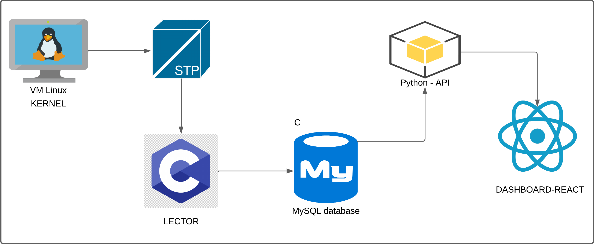
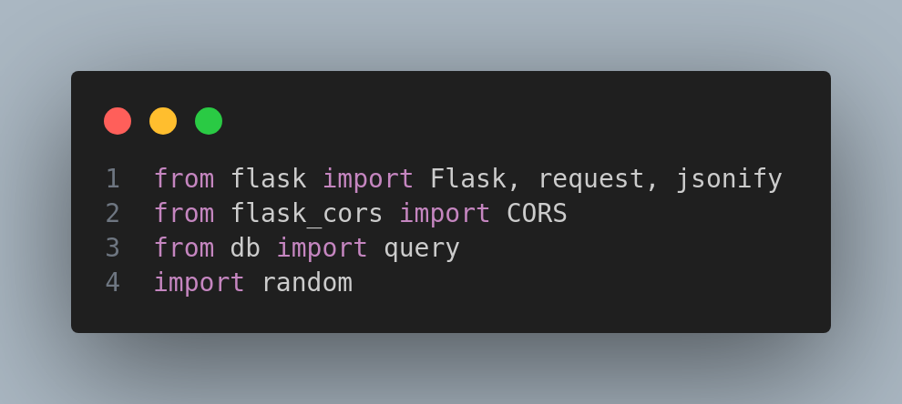
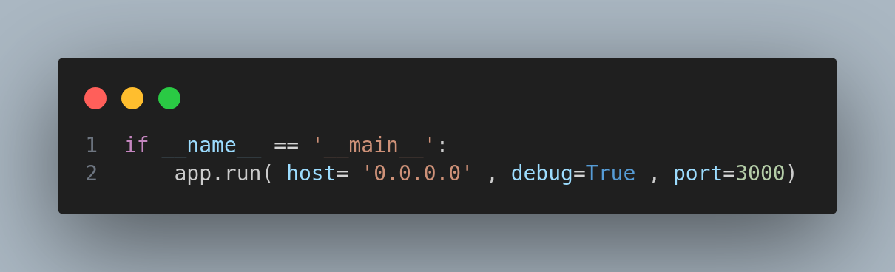
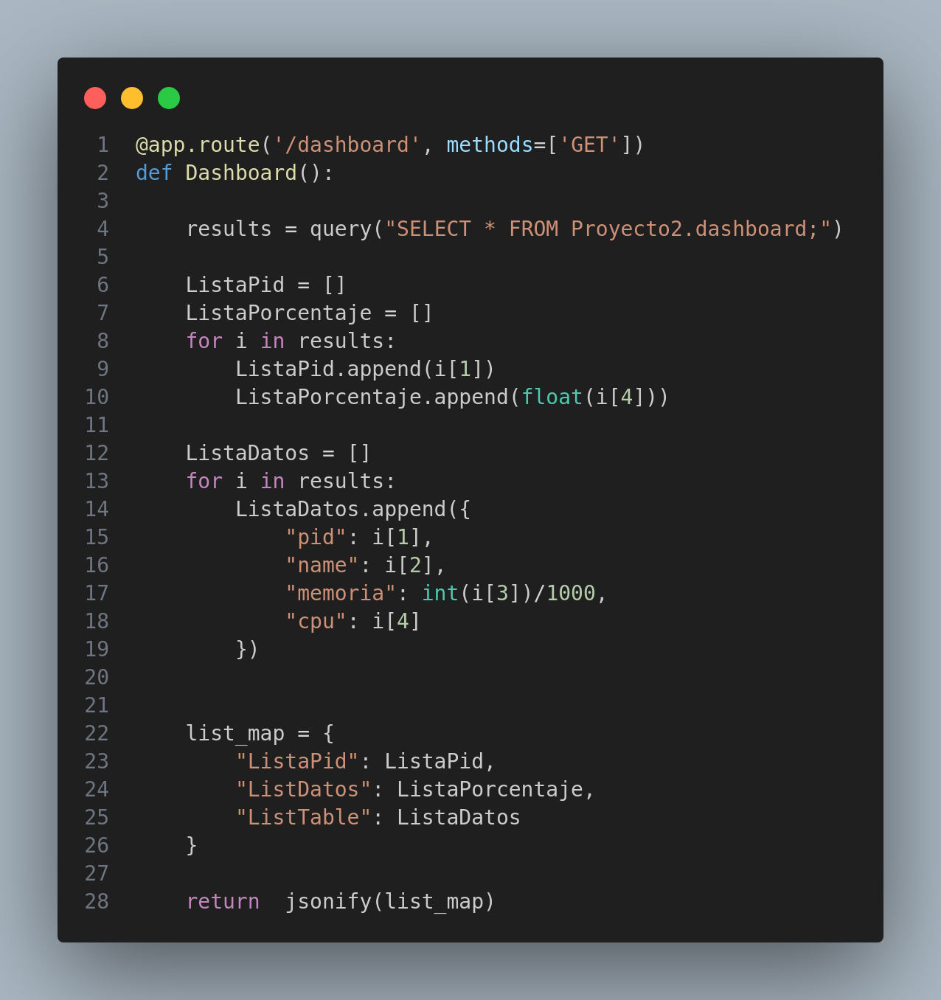
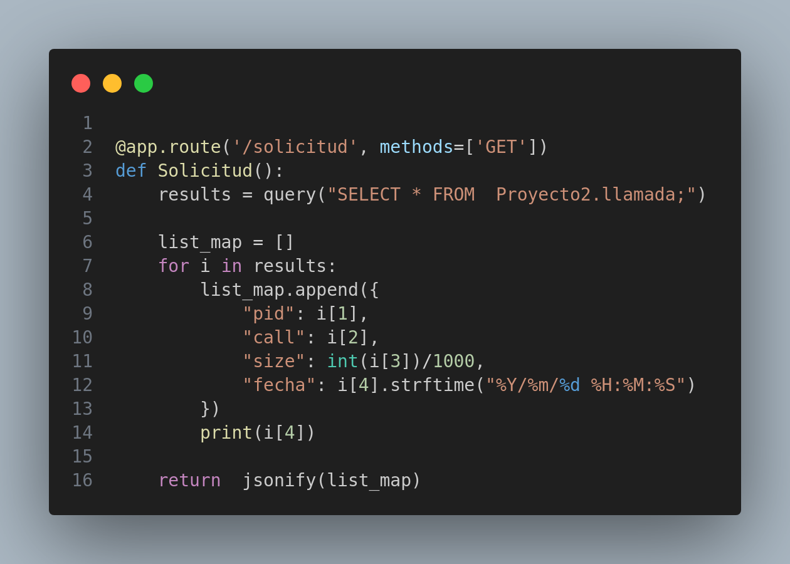
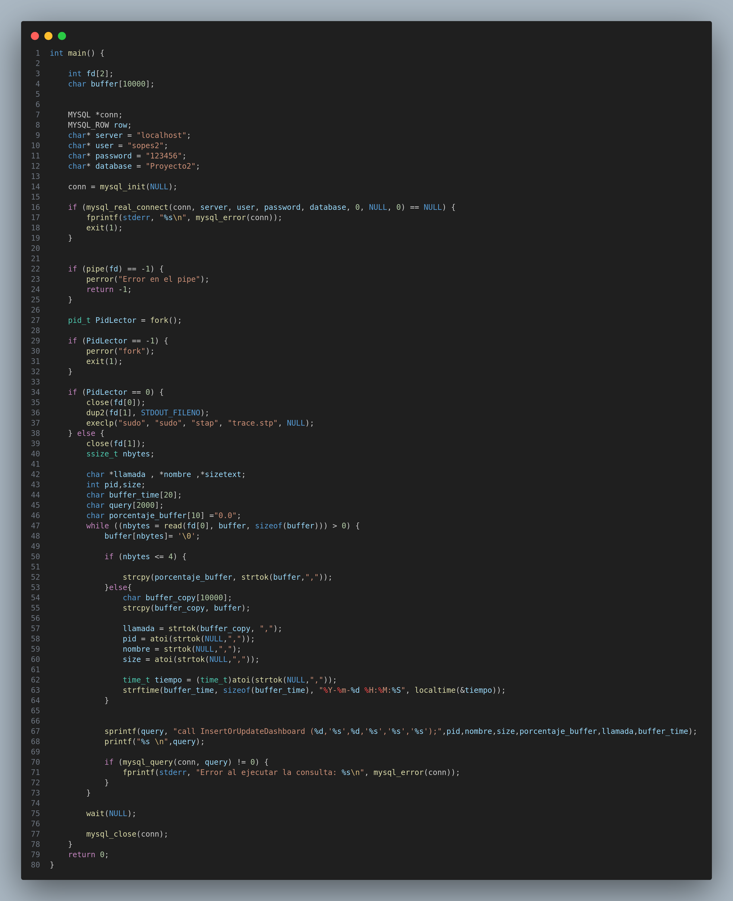

### Universidad de San Carlos de Guatemala
### Facultad de Ingenieria
### Escuela de Ciencias y Sistemas
### Sistemas Operativos 2

## Grupo 8
| Nombre           | Carnet       |
|:----------------:|:------------:|
|Jonatan Leonel Garcia Arana | 202000424 |
|Kemel Efrain Josue Ruano Jeronimo | 202006373 |

## Introduccion 
El presente manual técnico describe el desarrollo de una aplicación destinada a comprender el funcionamiento del manejo de memoria en el sistema operativo Linux Mint. Esta aplicación tiene como objetivo monitorear el uso de memoria de cada proceso en ejecución, detectando las solicitudes de memoria realizadas al sistema operativo. Se utilizarán herramientas como SystemTap para la captura de llamadas al sistema y MySQL para almacenar la información obtenida.
#
## Requerimientos minimos

- Sistema operativo: Linux Mint (versión específica, por ejemplo, Linux Mint 20.3 "Una").
- Procesador: Procesador compatible con arquitectura de 32 bits (x86) o 64 bits (x64)
- Memoria RAM: Se recomienda al menos 1 GB de RAM para compilaciones simples y
desarrollo básico en C. Para proyectos más complejos, se recomiendan 2 GB o más.
- Espacio en disco: Se recomienda un mínimo de 16 GB de espacio disponible en disco
- Herramientas de desarrollo: Compilador de C compatible con Linux Mint (se puede
instalar GCC, por ejemplo)
# 
## Instalación y Configuración de Herramientas de Desarrollo:
- Compilador GCC: El compilador GCC generalmente viene preinstalado en la mayoría de
las distribuciones de Linux, incluyendo Linux Mint. Si no está instalado, puede instalarlo
a través del gestor de paquetes de su distribución con el siguiente comando:
sudo apt-get install build-essential
- Editor de texto o IDE: Puede utilizar cualquier editor de texto de su preferencia, como
Vim, Emacs, o instalar un IDE como NetBeans, Code::Blocks, o Visual Studio Code
- Flask es un framework web ligero y flexible para Python. se utiliza para construir aplicaciones web rapidas y escalables
    - pip install Flask 
- Flask-CORS: es una extension para Flask que proporciona un manejo sencillo de solicitudes de recursos cruzados
    - pip install Flask-Cors
- Mysql es un sistema de gestion de bases de datos relacion de codigo abierto. para interactuar con una base de datos MYSQL desde python, se necesita un conector.
    - pip install mysql-connector-python
- React es una biblioteca de JavaScript para construir interfaces de usuarios. Es mantenida por facebook y una comunidad activa de desarrolladores, Vite es un entorno de desarollo web rapido y moderno que esta especialmente optimizado para el desarollo de aplicaciones web modernas utilizando tecnologias como React 
    - npm create vite "nombre proyecto"
    - npm install
    - npm run dev

#
## Arquitectura

## Iniciando Ejecucion del Programa
Para este proyecto estaremos diviendo el codigo en 3 carpetas, Backend, Fronted y Modulo C
### backend
- librerias utilizadas
    

- Metodo main:  hace que la aplicación Flask esté disponible para recibir y procesar solicitudes HTTP en una dirección IP específica y un puerto específico, y con la capacidad de recargar automáticamente cuando se realizan cambios en el código.
     

- Peticion Dashboard: 
Esta función define una ruta en la aplicación Flask para la URL '/dashboard'. Cuando se accede a esta ruta utilizando el método GET, la función realiza una consulta a la base de datos y devuelve los resultados en formato JSON. Los resultados incluyen tres listas: una lista de 'pid', una lista de 'porcentaje' y una lista de diccionarios que representan filas de la tabla 'dashboard' con las claves 'pid', 'name', 'memoria' y 'cpu'.
 

 - Peticion Solicitud: Esta función define una ruta en la aplicación Flask para la URL '/solicitud'. Cuando se accede a esta ruta utilizando el método GET, la función realiza una consulta a la base de datos y devuelve los resultados en formato JSON. Los resultados incluyen una lista de diccionarios que representan filas de la tabla 'llamada'. Cada diccionario tiene las claves 'pid', 'call', 'size' y 'fecha', donde 'pid' es el ID del proceso, 'call' es la llamada realizada, 'size' es el tamaño y 'fecha' es la fecha de la llamada.
  

### Modulo C

 - Lector
  
